# Database Entity Diagram

Full schema for the Goodie Bag platform (15 tables across 3 migrations).

```mermaid
erDiagram

  %% ── Catalog ───────────────────────────────────────────────────────────────

  product {
    bigserial   id               PK
    varchar50   sku              UK
    varchar100  name
    text        description      "nullable"
    varchar500  image_url        "nullable"
    numeric     cost
    numeric     cog_overhead
    numeric     cog_adjusted
    numeric     retail_price
    integer     inventory_quantity
    boolean     active
    smallint    min_age
    smallint    max_age
    varchar30   category
    varchar30   form_factor
    varchar20   upgrade_tier     "STANDARD | PREMIUM"
    varchar50   theme_code       "nullable"
    timestamptz created_at
    timestamptz updated_at
  }

  product_interest_affinity {
    bigint      product_id       PK,FK
    varchar30   interest         PK
    smallint    weight           "0–100"
  }

  product_audience_affinity {
    bigint      product_id       PK,FK
    varchar20   audience         PK
    smallint    weight           "0–100"
  }

  product_role_affinity {
    bigint      product_id       PK,FK
    varchar20   role             PK
    smallint    weight           "0–100"
  }

  product_occasion {
    bigint      product_id       PK,FK
    varchar20   occasion         PK
  }

  %% ── Bundle templates ──────────────────────────────────────────────────────

  bundle_template {
    bigserial   id               PK
    varchar30   code             UK
    varchar100  name
    smallint    min_age
    smallint    max_age
    boolean     active
  }

  bundle_template_slot {
    bigserial   id               PK
    bigint      bundle_template_id FK
    varchar30   slot_code
    smallint    display_order
    boolean     required
  }

  bundle_template_slot_role {
    bigint      slot_id          PK,FK
    varchar20   role             PK
  }

  %% ── Pricing ───────────────────────────────────────────────────────────────

  budget_tier {
    bigserial   id               PK
    varchar10   code             UK
    numeric     retail_min
    numeric     retail_max
    numeric     max_item_cogs
    numeric     target_retail_price
    boolean     active
  }

  gift_bag_option {
    bigserial   id               PK
    varchar30   code             UK
    varchar100  name
    text        description      "nullable"
    numeric     cost
    numeric     retail_price_adjustment
    boolean     active
    boolean     is_default
  }

  %% ── Generated bundles (snapshot / immutable) ──────────────────────────────

  generated_bundle {
    bigserial   id               PK
    varchar30   public_id        UK
    varchar100  session_id       "nullable"
    smallint    requested_age
    varchar20   audience_preference
    varchar30   interest
    varchar20   party_type
    bigint      budget_tier_id   FK
    bigint      bundle_template_id FK
    numeric     base_retail_price
    numeric     standard_item_cogs_snapshot
    varchar20   status           "GENERATED"
    timestamptz created_at
    timestamptz expires_at       "nullable"
  }

  generated_bundle_item {
    bigserial   id               PK
    bigint      generated_bundle_id FK
    varchar30   slot_code
    bigint      product_id       FK "snapshot ref; no CASCADE delete"
    varchar100  product_name_snapshot
    varchar50   sku_snapshot
    numeric     cost_snapshot
    text        description_snapshot "nullable"
    varchar30   form_factor_snapshot
    smallint    quantity_per_bag
    smallint    display_order
  }

  generated_bundle_upgrade {
    bigserial   id               PK
    bigint      generated_bundle_id UK,FK
    bigint      standard_product_id FK "nullable"
    varchar100  standard_product_name_snapshot "nullable"
    varchar50   standard_sku_snapshot "nullable"
    numeric     standard_cost_snapshot "nullable"
    numeric     standard_retail_adjustment_snapshot
    bigint      product_id       FK "premium; nullable"
    varchar100  product_name_snapshot "nullable"
    varchar50   sku_snapshot     "nullable"
    numeric     cost_snapshot    "nullable"
    numeric     retail_price_adjustment_snapshot
  }

  generated_bundle_gift_bag {
    bigint      generated_bundle_id PK,FK
    bigint      gift_bag_option_id  FK
    varchar100  name_snapshot
    numeric     cost_snapshot
    numeric     retail_price_adjustment_snapshot
    boolean     is_default
  }

  %% ── Analytics (no FK to bundles — events survive deletion) ───────────────

  analytics_event {
    bigserial   id               PK
    varchar50   event_type
    varchar100  session_id       "nullable"
    varchar30   bundle_id        "VARCHAR not FK — survives bundle deletion"
    text        metadata_json    "nullable"
    timestamptz created_at
  }

  %% ── Relationships ─────────────────────────────────────────────────────────

  product ||--o{ product_interest_affinity  : "has"
  product ||--o{ product_audience_affinity  : "has"
  product ||--o{ product_role_affinity      : "has"
  product ||--o{ product_occasion           : "tagged with"

  bundle_template ||--|{ bundle_template_slot      : "has slots"
  bundle_template_slot ||--|{ bundle_template_slot_role : "allows roles"

  budget_tier       ||--o{ generated_bundle : "priced by"
  bundle_template   ||--o{ generated_bundle : "structured by"

  generated_bundle ||--|{ generated_bundle_item       : "contains"
  generated_bundle ||--o| generated_bundle_upgrade    : "optionally has"
  generated_bundle ||--o| generated_bundle_gift_bag   : "optionally has"

  product ||--o{ generated_bundle_item    : "snapshot ref"
  product ||--o{ generated_bundle_upgrade : "standard ref"
  product ||--o{ generated_bundle_upgrade : "premium ref"

  gift_bag_option ||--o{ generated_bundle_gift_bag : "snapshot ref"
```

## Table Groups

| Group | Tables |
|-------|--------|
| **Catalog** | `product`, `product_interest_affinity`, `product_audience_affinity`, `product_role_affinity`, `product_occasion` |
| **Templates** | `bundle_template`, `bundle_template_slot`, `bundle_template_slot_role` |
| **Pricing** | `budget_tier`, `gift_bag_option` |
| **Generated bundles** | `generated_bundle`, `generated_bundle_item`, `generated_bundle_upgrade`, `generated_bundle_gift_bag` |
| **Analytics** | `analytics_event` |

## Key Design Decisions

- **Snapshot immutability** — `generated_bundle_item`, `generated_bundle_upgrade`, and `generated_bundle_gift_bag` store name/sku/cost snapshots at generation time. Product edits never retroactively change saved bundles.
- **Soft product reference** — `generated_bundle_item.product_id` is a FK with no `ON DELETE CASCADE`, so deleting a product that appears in a saved bundle is blocked (returns 409).
- **Analytics decoupling** — `analytics_event.bundle_id` is `VARCHAR`, not a FK, so analytics records survive bundle deletion.
- **Upgrade pair** — `generated_bundle_upgrade` stores both the standard and premium product as separate FKs (`standard_product_id` / `product_id`) with independent snapshots.
- **Affinity composite PKs** — All four affinity tables use `(product_id, <dimension>)` composite PKs, enforcing one weight per product per interest/audience/role/occasion.
